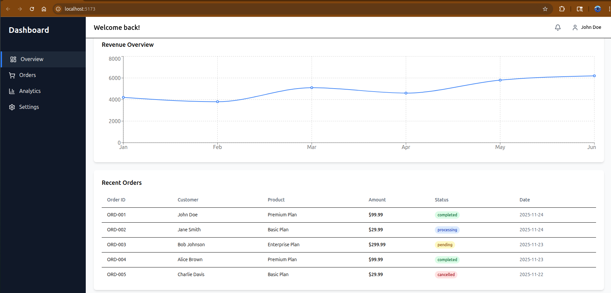
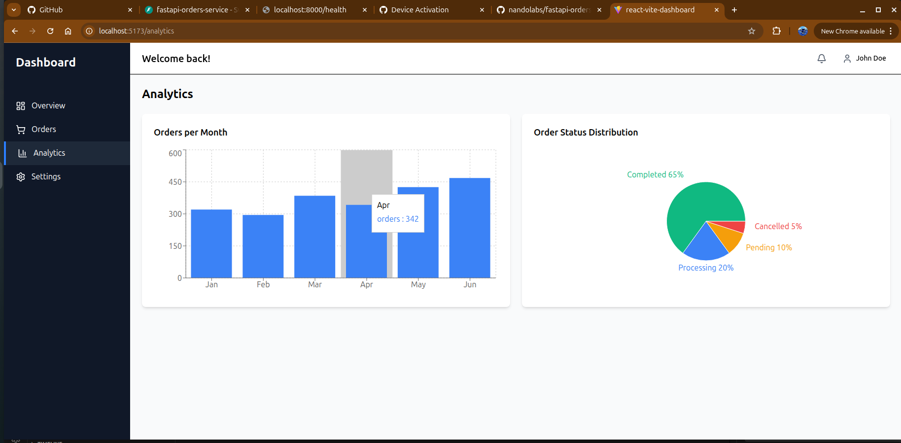
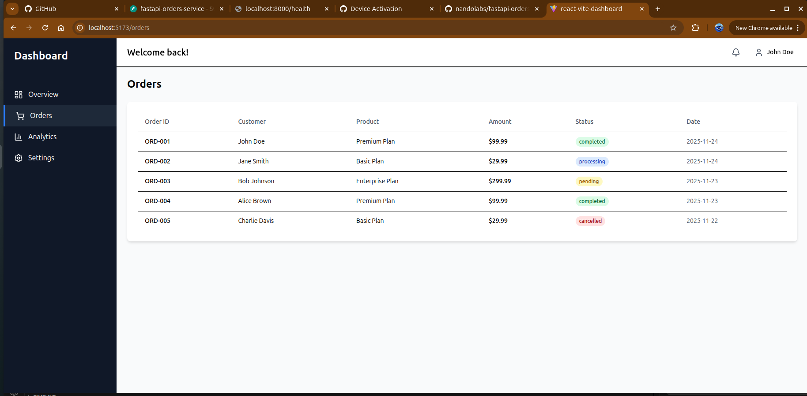

# 📄 **NEW README.md (Copy / Paste This)**

# React Vite Dashboard

A modern, responsive admin dashboard built with **React**, **Vite**, and **Tailwind CSS**, featuring charts, analytics, and data tables.  
Designed for SaaS apps, e-commerce platforms, and internal admin tools requiring clean UI, fast performance, and reusable components.

---

## Problem This Solves

Businesses often need a simple, elegant dashboard to visualize metrics, manage data, and provide insight into user activity.  
Building these dashboards from scratch can be time-consuming, especially when handling:

- Layouts & navigation  
- Data visualization  
- Responsive UI  
- Table rendering  
- State management  

This project provides a **ready-to-use professional dashboard** that accelerates development and reduces UI design effort.

---

## Core Features

- 📊 **Interactive charts** (line, bar, pie)
- 📈 **KPI analytics cards** (revenue, orders, customers, AOV)
- 🧾 **Styled data tables** (orders list)
- 🧭 **Sidebar navigation**
- 💨 **Vite-powered blazing-fast bundling**
- 🎨 **Tailwind CSS for modern UI styling**
- 📱 Fully responsive layout
- 🔧 Easy to extend with your own APIs

---

## Why This Matters for Your Project

- **Faster development cycles:** Skip design/layout work and instantly integrate the dashboard into any project.
- **Beautiful UI out of the box:** Modern, clean components ready for client demos or production.
- **Customizable:** Replace mock data with real API responses in minutes.
- **Great for MVPs and internal tools:** Saves hundreds of hours of frontend development time.
- **High performance:** Vite + React ensures instant feedback during development.

---

# 📸 UI Screenshots

### 🔹 Dashboard Overview  


---

### 🔹 Analytics View  


---

### 🔹 Orders Table  


---

## Installation

```bash
git clone https://github.com/nandolabs/react-vite-dashboard
cd react-vite-dashboard
npm install
npm run dev
````

App runs at:

```
http://localhost:5173
```

---

## Project Structure

```
src/
  components/
  pages/
  charts/
  data/
  layouts/
  App.jsx
  main.jsx
```

* **components/** – reusable UI parts
* **pages/** – Overview, Orders, Analytics, Settings
* **charts/** – LineChart, BarChart, PieChart
* **data/** – Mock data used for display (replace with your API)
* **layouts/** – Sidebar + top navigation layout

---

## Customization

### Replace mock data with API results

Example:

```jsx
useEffect(() => {
  fetch("/api/orders")
    .then(res => res.json())
    .then(data => setOrders(data));
}, []);
```

Charts & tables update automatically when data changes.

---

## Tech Stack

* **React 18**
* **Vite**
* **Tailwind CSS**
* **Recharts**
* **React Router**
* **Heroicons**

---

### NandoLabs

Building elegant, high-performance frontend experiences with modern React tooling.